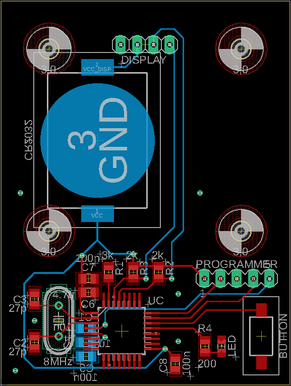

# Workshop-PCB

A nice little PCB for a soldering workshop I've done in the past. It has a mikrocontroller, a little OLED-display, a button, a LED and some SMD parts. \
When the button is pressed the display shows a text and the LED blinks, both for a time duration of ten minutes. The PCB is powered by a CR2032 coin cell battery.  

# The PCB design

The PCB is designed in order to be challenging but also to be fun to solder. Therefore the parts are surface mounted (SMD parts) with a size of 0805 which is kind of small, but not too small ;)  
 - The mikrocontroller is a [_STM32L062K8_](https://www.st.com/en/microcontrollers-microprocessors/stm32l062k8.html) from ST Microelectronics in a 32 pin LQFP package.

 - The OLED-display is bought from Amazon and is 1.3 inch in size. It communicates with the uC using the I2C protocol. The display is mounted on the main PCB with four screws.

 - For the processor clock an external crystal is used. It clocks with 8 MHz.  

 - Button debouncing is done in software in order to keep the PCB simple and because the workshop time was limited.  

  
  
# The parts

- Mikrocontroller \
[_STM32L062K8_](https://www.st.com/en/microcontrollers-microprocessors/stm32l062k8.html) (LQFP32 package)

- Button \
[_PTS636 SL43 SMTR LFS_](https://www.mouser.de/ProductDetail/CK/PTS636-SL43-SMTR-LFS?qs=vLWxofP3U2x0maTON%2FqK1g%3D%3D)

- Crystal \
[_ECS-80-18-4X-CKM_](https://www.mouser.de/ProductDetail/ECS/ECS-80-18-4X-CKM?qs=7MVldsJ5UazWVU6%2F43NmVA%3D%3D)

- 1.3 inch OLED display \
[_Link to Amazon_](https://www.amazon.de/AZDelivery-Display-Arduino-Raspberry-Gratis/dp/B078J78R45/ref=sr_1_2?__mk_de_DE=%C3%85M%C3%85%C5%BD%C3%95%C3%91&crid=2BH0U7SKDYO6I&keywords=oled%2B1.3&qid=1688516225&sprefix=oled%2B1.3%2Caps%2C98&sr=8-2&th=1)

- SMD LED \
[LG R971-KN-1](https://www.mouser.de/ProductDetail/ams-OSRAM/LG-R971-KN-1?qs=LsPilcdHE7EX1EB7GCLHxg%3D%3D) (size 0805)

- SMD capacitors and resistors (see down below)

- Pin header

- Coin battery _CR2032_

- SMD coin battery holder 

- screws and screw nuts (4x)
 
#### Capacitors (size 0805)
| Part | Value |
|------|-------|
| C1   | 10n   |
| C2   | 27p   |
| C3   | 27p   |
| C4   | 1u    |
| C5   | 100n  |
| C6   | 4.7u  |
| C7   | 100n  |
| C8   | 100n  |  

#### Resistors (size 0805)
| Part | Value |
|------|-------|
| R1   | 3k    |
| R2   | 2k    |
| R3   | 2k    |
| R4   | 200   |

# Eagle files
The files are located in the folder _eagle-files_.  

# Note
Also have a look at my blog [simon-cybersec.github.io](https://simon-cybersec.github.io) which is all about embedded systems, cybersecurity and other crazy stuff ;)